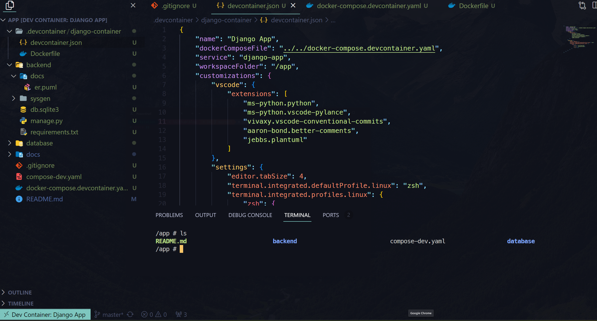

#  Desarrollo de Sistemas - VSCode Dev Containers

Cuando se desarrolla sistemas de forma independiente o se cuenta con un equipo de trabajo muy pequeño, por lo general no se suele tomar en cuenta la necesidad de trabajar con un mismo entorno de trabajo, ya que el encargado de sistemas puede realizar la instalación de los insumos necesarios en cada uno de los sistemas.

Todo esto cambia cuando el equipo de desarrollo crece o bien al trabajar como freelancer se tienen muchos proyectos que gestionar de forma simultanea.

En lugar de utilizar máquinas virtuales (como se hacía en la antigüedad) desaprovechando el rendimiento y limitando la productividad de los desarrolladores una mejor práctica es la utilización de Docker y docker-compose junto con la utilización de "Dev Containers".

En adelante mostraré como es posible armar un entorno de desarrollo utilizando estas herramientas con un ejemplo de un proyecto cuyo backend se desarrollará con Django.

## Estructura esperada del proyecto

La estructura que se espera del proyecto tiene la siguiente forma:

```bash
.
├── proyecto
│   ├── .devcontainer
│   │   ├── backend-django-container
│   │   │   ├── devcontainer.json
│   │   │   └── Dockerfile
│   │   ├── frontend-vue-container
│   │   │   ├── devcontainer.json
│   │   │   └── Dockerfile
│   │   └── frontend-vue-container
│   │       ├── devcontainer.json
│   │       └── Dockerfile
│   ├── backend-django
│   │   └── requirements.txt
│   ├── frontend-vue
│   ├── frontend-react
│   ├── .git
│   ├── .gitignore
│   └── docker-compose.yaml
```

# Manos a la obra

Supongamos que ya tenemos creada la estructura de archivos del proyecto. Es una buena práctica separar las configuraciones de los devcontainers por lo que dentro de la carpeta correspodiente al backend en Django crearemos dos archivos: `devcontainer.json` y `Dockerfile`

Dentro del `Dockerfile` empezaremos por la configuración básica para la creación de nuestro contenedor de desarrollo.

## Dockerfile para Django

Cada uno de los devcontainers utilizarán un contenedor Docker. Por esta razón es necesaria la creación de nuestro custom Dockerfile. En esta ocasión utilizaremos Python 3.10 bajo alpine.

`proyecto/.devcontainer/backend-django-container/Dockerfile`:

```Dockerfile
FROM python:3.10-alpine

WORKDIR /app
```

## docker-compose y servicio Django

Como estamos haciendo la configuración simultanea de varios devcontainers utilizaremos docker-compose.
Se recomienda que este se encuentre en la raíz del proyecto.

`proyecto/docker-compose.yaml`:

```yaml
version: '3.9'
services:
  django-app:
    build: 
      context: .devcontainer/backend-django
      dockerfile: Dockerfile
    volumes:
      - .:/app
    command: sleep infinity
    restart: unless-stopped
    ports:
      - 8000:8000
```

Donde:

`context: .devcontainer/backend-django`: Muestra el contexto (ubicación) del dockerfile

`command: sleep infinity`: Se utiliza para que el contenedor se mantenga activo. De lo contrario se cierra y no nos sirver como devcontainer.

## devcontainer.json para Django

Una vez tenemos completa la configuración del contenedor para Django, pasamos a la configuración del devcontainer.

`proyecto/.devcontainer/backend-django-container/devcontainer.json`:

```json
{
    "name": "Django App",
    "dockerComposeFile": "../../docker-compose.devcontainer.yaml",
    "service": "django-app",
    "workspaceFolder": "/app"
}
```

Donde:

`"name": "Django App"`: Es el nombre que le damos a nuestro contenedor de desarrollo.

`"dockerComposeFile": "../../docker-compose.yaml"`: Es la ubicación relativa del `docker-compose.ymal` que estamos utilizando.

`"service": "django-app"`: Es el nombre del servicio docker que estamos utilizando.

`"workspaceFolder": "/app"`: Es el espacio de trabajo sobre el que trabajará VSCode.


En este punto ya podemos hacer uso de nuestro contenedor de desarrollo iniciando el el docker-compose y conectandose de forma remota. Pero para hacerlo de forma con Visual Studio Code tenemos que instalar la extensión `Dev Containers` (ms-vscode-remote.remote-containers).

## Utilización del devcontainer

Ahora que tenemos lo necesario. En nuestro VSCode presionamos `Ctrl + P` y buscamos `>Dev Containers: Reopen in Container` con esto VSCode identificará que el proyecto con el que estamos trabajando cuenta con la carpeta `.devcontainer` y los archivos `devcontainer.json`.

Finalmente se abre el entorno de trabajo configurado.




# Conclusión

La utilización de IaC tanto en despliegue como en desarrollo ya es un estandar de la industria. El no utilizarlo no solo puede generar perdidas considerables de tiempo sino que también a mediano plazo puede generar malestar dentro de las organizaciones.
En lo que compete a los desarrolladores freelance todos los proyectos se mantienen ordenados y documentados facilitando el despliegue en servidores.