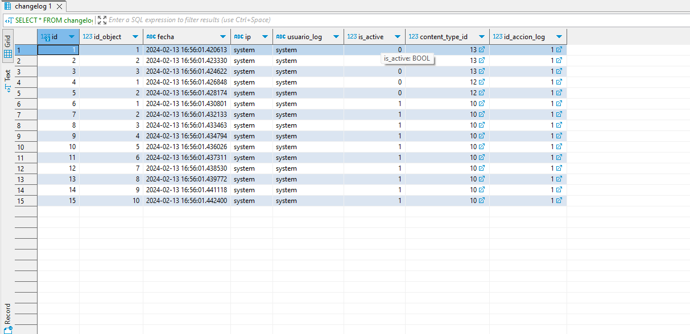

# Desarrollo de Sistema - Implementación de Changelog con Django

A medida que los registros de un sistema van creciendo en cantidad, es necesario mantener un registro básico de los cambios realizados por los usuarios.
Lo más común es almacenar la información de creación, modificación y eliminación.

Si bien se puede mantener los atributos en cada uno de los modelos, esto genera una enorme redundancia además de la perdida de registros anteriores, como se puede ver en el siguiente ejemplo:

```python
from django.db import models

class TipoUsuario(models.Model):
    descripcion = models.CharField(max_length=64)
    codigo = models.CharField(max_length=64)
    fecha_creacion = models.DateTimeField(auto_now_add=True)
    usuario_creacion = models.CharField(max_length=64)
    ip_creacion = models.GenericIPAddressField()
    fecha_modificacion = models.DateTimeField(auto_now=True)
    usuario_modificacion = models.CharField(max_length=64)
    ip_modificacion = models.GenericIPAddressField()
    fecha_eliminacion = models.DateTimeField(null=True, blank=True)
    usuario_eliminacion = models.CharField(max_length=64, null=True, blank=True)
    ip_eliminacion = models.GenericIPAddressField(null=True, blank=True)
    is_active = models.BooleanField(default=True)
```

En el ejemplo de la clase `TipoUsuario` solamente nos interesan los atributos `descripcion` y `codigo`, el resto de atributos se mantiene sin uso dejando las tablas de la base de datos con grandes espacios incompletos.

Tomando en cuenta que se desea guardar el registro de cambios en todos los modelos del sistema se puede abordar la solución de forma diferente.

## Estructura esperada del proyecto

La estructura que se espera del proyecto tiene la siguiente forma:

```bash
.
│
├── proyecto
│   └── backend-django
│       ├── base
│       │   ├── classes
│       │   │   ├── AccionLog.py
│       │   │   ├── Changelog.py
│       │   │   └── TipoUsuario.py
│       │   ├── models.py
│       │   └── ...
│       └── backend-django
│           ├── settings.py
│           └── ...

```

# Manos a la obra

Es necesaria la modificación de la clase `TipoUsuario`, así que la dejamos de la siguiente forma:

```python
from django.db import models

class TipoUsuario(models.Model):
    descripcion = models.CharField(max_length=64)
    codigo = models.CharField(max_length=64)
    is_active = models.BooleanField(default=True)
```

Con esto queda mucho más entendible y podemos crear el modelo para el almacenamiento del changelog.

```python
from django.db import models
from django.contrib.contenttypes.models import ContentType
from django.contrib.contenttypes.fields import GenericForeignKey

from base.models import AccionLog

class Changelog(models.Model):
    id_accion_log = models.ForeignKey(AccionLog, models.DO_NOTHING, db_column='id_accion_log', default=None)
    id_object = models.PositiveIntegerField()
    content_type = models.ForeignKey(ContentType, on_delete=models.DO_NOTHING)
    content_object = GenericForeignKey('content_type', 'id_object')
    fecha = models.DateTimeField(auto_now=True)
    ip = models.CharField(max_length=64, blank=True, null=True)
    usuario_log = models.CharField(max_length=64, blank=True, null=True)
    is_active = models.BooleanField(default=True)
```

Podemos ver que la clase `Changelog` tiene una clave foránea de `AccionLog`, en dicha clase se almacenan los tipos de log `Creacion`, `Modificacion` y `Eliminacion`.
También podemos observar atributos que hacen referencia al `ContentType` de Django, ya que almacenaremos los identificadores de las tablas junto con el `id_object`, que es el identificador del objeto cuyo cambio estamos registrando.

La clase `AccionLog` es la siguiente:

```python
from django.db import models

class AccionLog(models.Model):
    descripcion = models.CharField(max_length=512)
    codigo = models.CharField(max_length=64)
    is_active = models.BooleanField(default=True)

    class Meta:
        managed = True
        db_table = 'accion_log'
```

Con esto se tiene la estructura básica, sin embargo es necesario crear el método que será llamado `post_save`. Crearemos dicho método en la clase `Changelog` como sigue a continuación:

```python
    @classmethod
    def register(cls, sender, instance, created, **kwargs) -> None:
        usuario_log = 'system' if not getattr(instance, 'usuario_log', None) else getattr(instance, 'usuario_log', None)
        ip = 'system' if not getattr(instance, 'ip', None) else getattr(instance, 'ip', None)
        content_object = ContentType.objects.get_for_model(instance)

        if created:
            accion_log = AccionLog.objects.get(codigo='1')
        elif usuario_log == 'system' or ip == 'system':
            raise ValueError('Debe ingresar un usuario y una ip para realizar esta acción')
        else:
            accion_log = AccionLog.objects.get(codigo='2' if instance.is_active else '3')
        
        cls.objects.filter(id_object=instance.id, is_active=True).update(is_active=False)
        
        changelog = cls(
            id_accion_log=accion_log,
            id_object=instance.id,
            content_type=content_object,
            usuario_log=usuario_log,
            ip=ip,
            is_active=True
        )
        changelog.save()
```

Ahora es necesario crear el receiver en la clase `TipoUsuario` y hacer uso del método `register` de la clase Changelog por lo que agregamos el siguiente código a `TipoUsuario`

```python
from django.db.models.signals import post_save
from django.dispatch import receiver

from base.models import Changelog

@receiver(post_save, sender=TipoUsuario)
def save_tipo_usuario(sender, instance, created, **kwargs):
    Changelog.register(sender, instance, created, **kwargs)
```

### Forma de uso

Una vez completamos la configuración solo hace falta llamar al método `save()` de `TipoUsuario` para que se almacene de forma correcta un log como se puede ver en el siguiente ejemplo:

```python
from base.models import TipoUsuario

tipo_usuario = TipoUsuario(descripcion='test', codigo='test')
tipo_usuario.ip = '192.168.0.1'
tipo_usuario.usuario_log = 'testencio'
tipo_usuario.save()
```

Como podemos ver se agrega al objeto `tipo_usuario` tanto `ip` como `usuario_log`. Estos campos son opcionales al momento de la creación pero no al modificar el objeto.



## Conclusión

Logramos reducir la cantidad de código tanto en los `models.py` de Django como al momento de realizar el almacenamiento de la información.
Además ahora tenemos un registro historico para cada uno de los objetos que utilice este Changelog logrando mejorar la consistencia de la información en la base de datos.