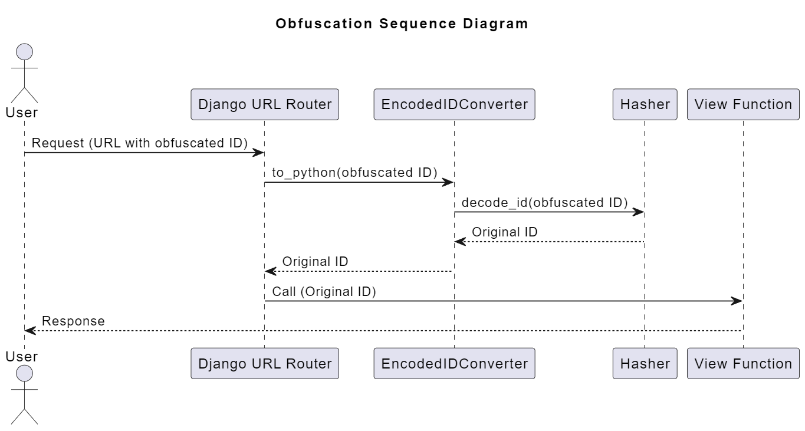

# Desarrollo de Sistemas - Obfuscación de IDs con Django

La seguridad de los sistemas es un aspecto crucial en el desarrollo de sistemas.
Se debe tomar en cuenta que agregar una capa adicional de seguridad a la información siempre es una buena idea ya que dificulta el uso malintencionado de la información.

Los Ingenieros de Datos hacemos Web Scraping de forma frecuente como una forma de obtener información con facilidad.
Es increible la gran cantidad de información que se encuentra disponible en Internet a la que se puede acceder de esta forma.
Incluso existe gran cantidad de información sensible.

En un mundo ideal toda esta información se disponible podría ayudar a los investigadores y Científicos de Datos a generar modelos con mayor facilidad.
Sin embargo, al no encontrarnos en este mundo ideal, no podemos fiarnos de la información que dejamos disponible al público.
Por esta razón es necesaria la incorporación de una capa adicional de seguridad sobre nuestros datos.


## ¿Obfuscación?

La obfuscación en el contexto del desarrollo de software es la práctica de hacer algo difícil de entender o interpretar.
Usualmente se utiliza para prevenir la ingeniería inversa y ocultar información sensible.

En el contexto de los datos, la obfuscación generalmente se refiere a las técnicas utilizadas para anonimizar o pseudonimizar los datos, dificultando su rastreo hasta la fuente original o entender su forma original.
Esto se hace a menudo para proteger la privacidad o la información sensible.

## Estructura esperada del proyecto

En esta ocasión la estructura de esperada del proyecto Django es sencilla, la misma se muestra a continuación:

```bash
proyecto
    ├── proyecto
    │   ├── settings.py
    │   ├── urls.py
    │   └── ...
    ├── base
    │   ├── security
    │   │   ├── Hasher.py
    │   │   └── EncodedIDConverter.py
    │   ├── views.py
    │   └── urls.py
    ├── manage.py
    └── requirements.txt

```        

# Manos a la obra

Primero que nada, es necesario tener una forma modificar los IDs.
En esta ocasión utilizaremos la biblioteca `cryptography` de python la cual nos facilitará el trabajo de `hashing`:

```python
from cryptography.fernet import Fernet, InvalidToken
from cryptography.hazmat.primitives import hashes
from cryptography.hazmat.primitives.kdf.pbkdf2 import PBKDF2HMAC
import base64
import os

class Hasher:
    HASHER_SALT = os.environ.get('HASHER_SALT')
    HASHER_PASSWORD = os.environ.get('HASHER_PASSWORD')
    SALT = HASHER_SALT.encode('utf-8')
    KEY = base64.urlsafe_b64encode(PBKDF2HMAC(
        algorithm=hashes.SHA256(),
        length=32,
        salt=SALT,
        iterations=100000,
    ).derive(os.environ.get('HASHER_PASSWORD').encode('utf-8')))

    @staticmethod
    def encode_id(id):
        f = Fernet(Hasher.KEY)
        # Convert the ID to bytes
        id_bytes = str(id).encode('utf-8')
        # Encrypt the ID
        encrypted_id = f.encrypt(id_bytes)
        return encrypted_id.decode('utf-8')

    @staticmethod
    def decode_id(encrypted_id):
        f = Fernet(Hasher.KEY)
        # Decrypt the ID
        try:
            id_bytes = f.decrypt(encrypted_id.encode('utf-8'))
        except (InvalidToken, DecryptionError):
            raise DecryptionError('Error al desencriptar el ID')
        return id_bytes.decode('utf-8')

```

Como parte de las buenas prácticas en ningún momento de almacenan secretos en el código ni en base de datos.
Por lo cual obtenemos la información directamente de las variables de entorno del sistema.

El funcionamiento de estos métodos es simple, `encode_id` como su nombre lo menciona codifica un id recibido.
Mientras que `decode_id` recupera el verdadero valor (decodifica).

Ahora que nuestra clase `Hasher` está lista podemos crear el conversor que será utilizado en nuestras URLs.


```python
from base.security.Hasher import Hasher

class EncodedIDConverter:
    regex = '[A-Za-z0-9_=-]+'

    def to_python(self, value):
        return Hasher.decode_id(value)

    def to_url(self, value):
        return Hasher.encode_id(value)
```

Todos los convertidores de URL de Django deben definir un atributo regex.
Este atributo es una expresión regular en forma de cadena que Django utiliza para hacer coincidir esta parte de la URL al procesar una solicitud.

El método `to_python` se utiliza para convertir la cadena coincidente en un objeto Python que se utilizará en su vista.
El método `to_url` se utiliza para convertir un objeto Python de nuevo en una cadena para su uso en una URL.

Ahora que tenemos todos los insumos podemos aplicarlos directamente sobre nuestras URLs.
Para esto es necesario registrar nuestro convertidor.

```python
from django.urls import path, register_converter
from base import views
from base.security.EncodedIDConverter import EncodedIDConverter

register_converter(EncodedIDConverter, 'encoded_id')

app_name = 'base'

urlpatterns = [
    path('hola_mundo/<encoded_id:pk>', views.hola_mundo_view, name='hola_mundo'),
    path('eliminar_usuario/<encoded_id:pk>', views.eliminar_usuario_view, name='eliminar_usuario'),
]

```

Con la modificación hecha en nuestras URLs no es necesario realizar cambios en nuestras vistas por lo que nuestro archivo `views.py` se mantiene igual:


```python
from django.shortcuts import render
from django.http import HttpResponse, HttpResponseNotAllowed

def hola_mundo_view(request, pk):
    usuario = Usuario.objects.get(pk=pk)
    return render(request, f'Bienvenido {usuario.nombre}', context)

def eliminar_usuario_view(request, pk):
    if request.method != 'DELETE':
        return HttpResponseNotAllowed("DELETE")
    usuario = Usuario.objects.get(pk=pk)
    usuario.is_active = False
    usuario.ip = request.META.get('REMOTE_ADDR')
    usuario.usuario_log = request.user
    usuario.save()
    return HttpResponse(status=204)

```

# Conclusión

Como se puede observar la implementación de este obfuscador no requiere de mayores modificaciones en las vistas por lo que si el proyecto mantuvo las buenas practicas provenientes del estandar PEP8 los cambios se aplican facilmente sobre las URLs.

Esta simple y pequeña implementación ayuda prevenir la ingeniería inversa mediante Web Scraping y ayuda a mantener la privacidad de la información.

