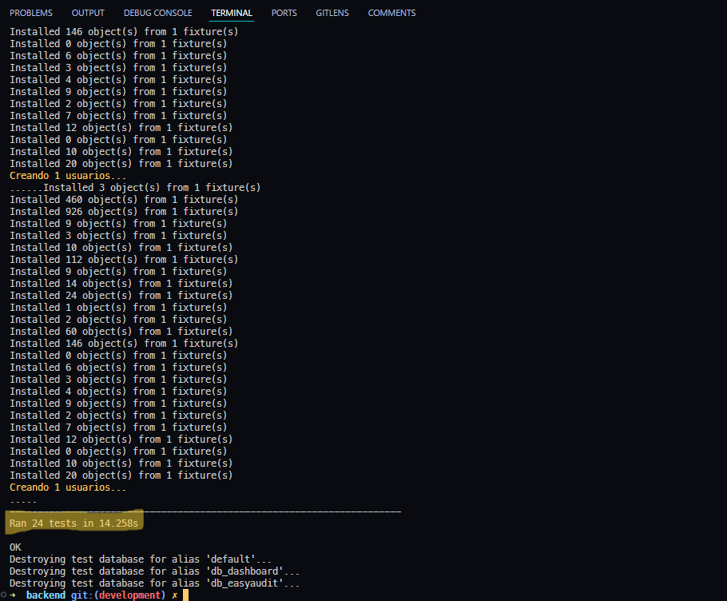
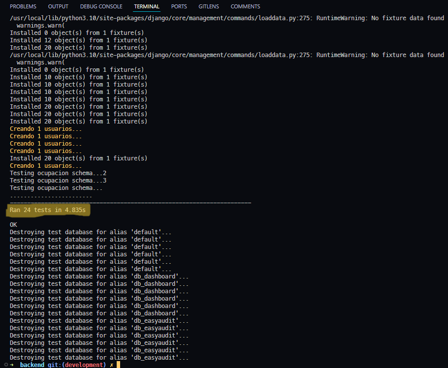

# Building an Efficient Testing Environment in Django Optimized for Continiouos Integration

Testing is the backbone of reliable software development. In Django projects, especially those leveraging Continuous Integration (CI), a well-optimized testing environment ensures high-quality code, faster feedback loops, and seamless deployments. This article delves into practical strategies for setting up a Django testing environment that is both fast and scalable, covering everything from configuration tweaks to CI integration

## Why an Efficient Testing Environment Matters

An optimized testing setup is vital for:

- Speed: Reducing test execution time accelerates development cycles.
- Reliability: Automated tests consistently verify code changes, catching issues early.
- Team Productivity: Faster pipelines mean less waiting time and quicker iterations.

In CI workflows, even a minor optimization in test execution time can result in significant efficiency gains, especially for larger teams or projects.

## Optimizing Django's Test Settings

Customizing Django’s settings for testing is one of the first steps toward an efficient environment. Here are key adjustments to make:

### 1. Use SQLite for Testing

SQLite, especially in-memory databases, is exceptionally fast for test environments since it eliminates disk I/O. Configure your `DATABASES` setting like this:

```python
DATABASES = {
    'default': {
        'ENGINE': 'django.db.backends.sqlite3',
        'NAME': ':memory:',  # In-memory database for maximum speed
    },
    'db_easyaudit': {
        'ENGINE': 'django.db.backends.sqlite3',
        'NAME': ':memory:',
    },
    'db_dashboard': {
        'ENGINE': 'django.db.backends.sqlite3',
        'NAME': ':memory:',
    },
}

```

### 2. Enable Parallel Testing

Parallel testing leverages multiple CPU cores to run tests faster. Django’s default test runner already supports this. Ensure you’re using the appropriate runner in `settings.py`:

```python
TEST_RUNNER = 'django.test.runner.DiscoverRunner'  # Default configuration

```

## Creating a Reusable Base Test Case

A reusable base test class standardizes test setup across your project, making tests more predictable and efficient. Below is an example:

```python
import glob
from django.core.management import call_command
from django.test import TestCase

class BaseTestCase(TestCase):
    databases = {'default', 'db_easyaudit', 'db_dashboard'}

    @classmethod
    def setUpTestData(cls):
        # Load fixtures
        fixtures = sorted(glob.glob('initial/*.json'))
        for fixture in fixtures:
            call_command('loaddata', fixture, verbosity=1)

        # Create a sysadmin user
        call_command('instasysadmin', verbosity=0)

```

### Benefits

- Predictability: Ensures a consistent environment for all tests.
- Reusability: Reduces duplication by centralizing common setup tasks.
- Flexibility: Supports multiple databases and fixture loading seamlessly.


### Example Usage

Extend `BaseTestCase` to create specific test cases, such as testing GraphQL schemas:

```python
from base.tests import BaseTestCase

class StaffSchemaTestCase(BaseTestCase):
    def test_create_staff(self):
        # Test logic here
        pass

```


## Running Tests: Normal vs. Parallel Execution

Django provides options for running tests sequentially or in parallel.

### 1. Normal Test Execution

For sequential test execution, use:

```python
python manage.py test
```


### 2. Parallel Test Execution

Speed up test runs by utilizing multiple CPU cores:

```
python manage.py test --parallel
```


## Performance Comparison: SQLite vs. Traditional Databases


The choice of database significantly affects test performance. Here’s a quick comparison:

| Database                 | Execution Time        | Setup Overhead              |
|--------------------------|------------------------------------|-----------------------------|
| SQLite (single-thread)   | 14.258 seconds                     | Low                         |
| MySQL/Postgres           | 240 seconds                        | Medium                      |
| SQLite (multi-thread)    | 4.83 seconds                       | Low                         |


### Why SQLite is Faster

SQLite is faster in test environments primarily because it can use in-memory databases. This means that all database operations are performed in RAM, which is significantly faster than reading from or writing to a hard disk. This eliminates the disk I/O overhead, resulting in much quicker test execution times. Additionally, SQLite's lightweight nature and minimal setup overhead make it an ideal choice for testing scenarios where speed is crucial.


## Conclusion

An efficient testing environment in Django not only improves test execution times but also enhances team productivity by reducing pipeline delays. Using SQLite for testing, enabling parallelism, and integrating into CI pipelines like GitHub Actions or Jenkins ensures faster feedback and smoother development cycles.